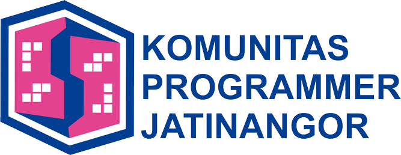

# Komunitas Engineer Jatinangor

Komunitas ini terbentuk di jatinangor dengan maksud dan tujuan untuk mempertemukan teman-teman yang mempunyai hobi dari latar belakang yang sama berkaitan dengan teknologi atau teman-teman yang ingin belajar tentang teknologi terbaru, komunitas ini mencakup di wilayah sekitaran jatinangor seperti sumedang dan bandung dan luar wilayah sumedang.

Ini adalah repository untuk kegiatan yang dilakukan oleh komunitas engineer jatinangor. di repository ini akan menyajikan beberapa source code code experiment, foto kegiatan dan presentasi yang dibawakan oleh speaker atau teman-teman yang berkontribusi di komunitas ini. 

* [Photo Kegiatan](./photo-kegiatan)
* [Presentasi](./presentasi)
* [Eksperimen](./eksperimen)