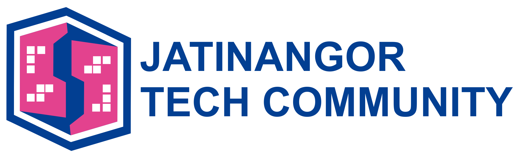

# Jatinangor Tech Community

[Indonesian](#indonesian) |  [English](#english)

## **Indonesian**
Jatinangor Tech Commmunity ini terbentuk dengan maksud dan tujuan untuk menjadi tempat berkolaborasi, belajar, dan berbagi pengetahuan terkait teknologi dan dunia digital.  

Target audience komunitas ini luas yaitu untuk pelajar, pengembang perangkat lunak (developers/programmer/software engineer), insinyur (engineer), masyarakat umum atau profesi yang berhubungan dengan industri teknologi atau digital terkait.

Semoga dengan adanya jatinangor tech community ini bisa mempertemukan para praktisi teknologi atau penggiat teknologi dan teman-teman yang mempunyai hobi dari latar belakang yang sama atau teman-teman yang ingin belajar tentang teknologi terbaru.

Dan repositori didedikasikan sebagai dokumentasi kegiatan yang dilakukan oleh jatinangor tech community. 

Di repositori ini nantinya akan menyajikan beberapa sumber kode eksperimen, referensi, foto kegiatan dan presentasi yang sudah dibawakan oleh speaker atau teman-teman yang berkontribusi di komunitas ini. 

* [Photo Kegiatan](/photo-kegiatan)
* [Presentasi](/presentasi)
* [Eksperimen](/eksperimen)

Jika ingin bergabung dengan jatinangor tech community ini, silahkan [daftar](/daftar) dengan membuat issues di repositori ini dengan mengikuti format yang sudah disediakan atau bisa memberitahu admin jatinangor tech community di email
[admin@jatinangortechcommunity.xyz](mailto:admin@jatinangortechcommunity.xyz)

## **English**

Jatinangor Tech Community was formed with the intent and purpose to become a place to collaborate, learn, and share knowledge related to technology and the digital world.

The target audience of this community is broad, namely students, software developers/developers/programmers/software engineer, engineers (engineers), the general public or professions related to related technology or digital industries.

Hopefully with this Jatinangor tech community, it can bring together technology practitioners or technology activists and friends who have hobbies from the same background or friends who want to learn about the latest technology.

And the repository is dedicated as a documentation of activities carried out by the jatinangor tech community.

This repository will present some source of experimental code, references, photos of activities and presentations that have been brought by speakers or friends who contribute to this community.

* [Activity Photos](/photo-kegiatan)
* [Presentation](/presentasi)
* [Experiment](/eksperimen)

If you want to join this Jatinangor Tech Community, please [register](/daftar) by creating issues in this repository by following the format provided or you can inform the Jatinangor Tech Community admin at email [admin@jatinangortechcommunity.xyz](mailto:admin@jatinangortechcommunity.xyz)